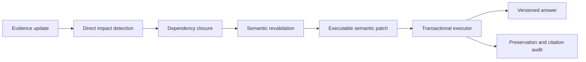
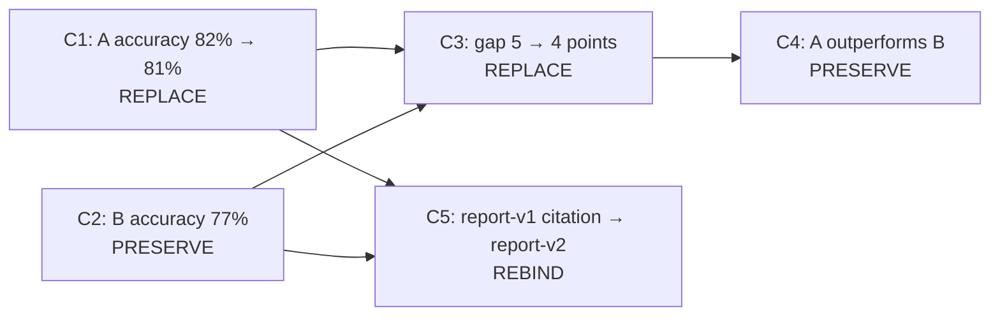
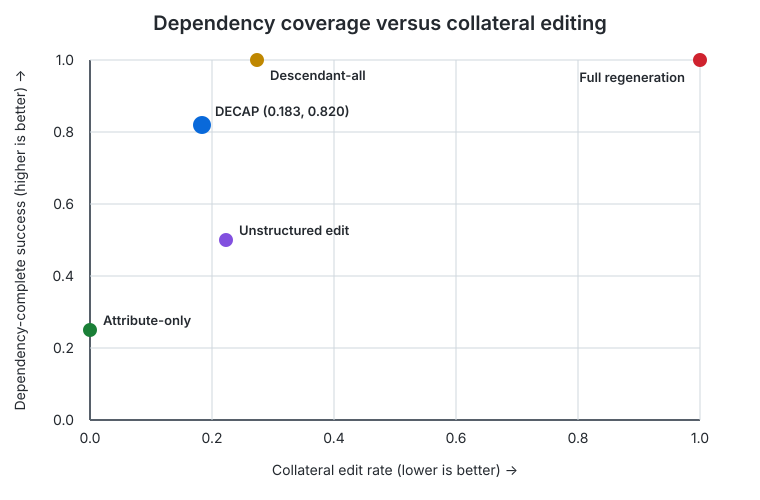

# ClaimPatch

[](https://github.com/gangmurloc/ClaimPatch/actions/workflows/tests.yml)

[한국어 README](README_KR.md)

**Dependency-Complete Semantic Patching for Evolving LLM Answers**

ClaimPatch asks a focused question: when the evidence behind a long-form answer
changes, can a system update every affected downstream claim while preserving
claims that remain valid? It represents an answer as a versioned claim graph,
predicts which claims must change, emits an executable semantic patch, and
applies that patch transactionally.

This is a compact research artifact extracted from a larger experimental
workspace. It contains the executable core, prompts, reproducible synthetic
benchmark generator, representative aggregate results, and 54 unit tests. Raw
model outputs, local checkpoints, caches, and exploratory runs are intentionally
excluded.

## Why this project

Regenerating an entire answer after a small evidence update can introduce
collateral changes. Editing only the directly mentioned sentence can leave
derived comparisons or citations stale. ClaimPatch treats revision as a
dependency and transaction problem rather than unconstrained rewriting.



Supported patch operations are `REPLACE`, `DELETE`, `INSERT`, `SPLIT`,
`MERGE`, `REBIND`, and `INVALIDATE`. Preconditions, graph validation, and
copy-on-write execution prevent a malformed patch from partially mutating the
stored answer.

## What makes ClaimPatch different

ClaimPatch does not edit model weights, and it is not a generic factuality
scorer or an unconstrained answer rewriter. Its object of maintenance is an already
generated, evidence-grounded answer. Given an evidence delta, it identifies
directly stale claims, follows explicit dependencies, revalidates downstream
claims, and emits a minimal executable patch with preservation constraints.

The closest neighboring areas are post-hoc factual revision, claim-level
attribution, knowledge editing, and stale-memory maintenance. A concise
comparison with representative work—including RARR, PaperTrail, FActScore,
ROME, MEMIT, STALE, and Supersede—is available in
[`docs/related_work.md`](docs/related_work.md).

## Patch example

Suppose two systems initially score 82% and 77%. A revised report lowers the
first score to 81%. The numeric difference changes from five to four percentage
points, but the qualitative relation remains *outperforms* under the benchmark
threshold.



A direct-only editor can miss `C3` and the citation update. An update-all-
descendants policy changes `C4` even though it is still true. ClaimPatch
separates dependency reachability from the semantic decision to revise or preserve.

## Representative result

The main included diagnostic uses Qwen2.5-7B-Instruct on 100 synthetic
benchmark instances with three sequential evidence updates each (300 evaluated
steps). The benchmark is controlled and synthetic; it is not evidence of
real-world robustness.

| System | DCS | Patch precision | Patch recall | Collateral edit | Residual stale |
|---|---:|---:|---:|---:|---:|
| ClaimPatch prompted | **0.820** | **0.835** | **0.926** | **0.183** | **0.074** |
| Unstructured selective edit | 0.500 | 0.780 | 0.807 | 0.223 | 0.193 |
| Attribute-only, no graph | 0.250 | 1.000 | 0.662 | 0.000 | 0.338 |
| Update all descendants | 1.000 | 0.745 | 1.000 | 0.273 | 0.000 |
| Full regeneration | 1.000 | 0.505 | 1.000 | 1.000 | 0.000 |

`DCS` is dependency-complete success: every claim that must change is changed,
with no required update omitted. Against unstructured selective editing, the
paired DCS difference is **+0.320**, with a 95% bootstrap interval of
**[0.257, 0.380]**. ClaimPatch does not dominate the deliberately aggressive
descendant-all oracle-like policy on DCS; its purpose is to reduce unnecessary
editing while retaining dependency coverage.

Exact aggregate files are under
[`results/p1_qwen_sequential_100x3/`](results/p1_qwen_sequential_100x3/).
Held-out, metadata-ablation, and second-model diagnostics are summarized in
[`results/diagnostics/`](results/diagnostics/).

> **Reproducibility note.** The reported Qwen run is a historical diagnostic,
> not a bitwise-reproducible model run: its model revision and source commit
> were not captured, and its raw generations are not distributed. The current
> code records model/source/runtime provenance for future runs, while the
> deterministic P0 path and unit tests remain directly reproducible. See the
> [archived environment record](environment/reported_qwen_run.md) for the exact
> boundary between captured facts and later reconstruction.

The DCS–collateral-edit trade-off is shown below. The aggressive descendant-all
policy maximizes DCS by editing more valid claims, whereas ClaimPatch occupies
a more selective operating point.



## Install

```bash
git clone https://github.com/gangmurloc/ClaimPatch.git
cd ClaimPatch
python -m venv .venv
source .venv/bin/activate
pip install -e ".[dev]"
```

The deterministic path needs no model download or GPU. Local LLM experiments
use the optional dependencies:

```bash
pip install -e ".[dev,local]"
```

The command name is `claimpatch`. A deprecated `decap` alias is retained only
for compatibility with the repository's legacy CI invocation and may be
removed after that workflow is migrated.

## Quick start

Run the deterministic 100-instance, three-update benchmark:

```bash
claimpatch run-p0 --config configs/experiments/p0_rule_based.yaml
```

Run a fast smoke test:

```bash
claimpatch run-p0 --config configs/experiments/p0_rule_based.yaml --limit 4
pytest -q
```

Run the structured mock pipeline, which exercises prompt rendering, JSON
parsing, schema validation, patch execution, and evaluation without an external
model:

```bash
claimpatch run-p1 --config configs/experiments/p1_prompted.yaml --limit 4
```

For the reported local-Qwen protocol, first ensure the model is available in
the Hugging Face cache and then run:

```bash
CUDA_VISIBLE_DEVICES=0 sh scripts/run_p1_local_full100x3.sh
```

## Repository map

| Path | Purpose |
|---|---|
| `src/claimpatch/schemas/` | Typed evidence, claim, graph, update, and patch contracts |
| `src/claimpatch/graph/` | Dependency validation, traversal, and versioning |
| `src/claimpatch/impact/` | Direct-impact detection and dependency propagation |
| `src/claimpatch/patch/` | Patch construction, validation, audit, and execution |
| `src/claimpatch/pipelines/` | Deterministic, prompted, and prose-adapter pipelines |
| `src/claimpatch/evaluation/` | DCS, preservation, citation, cost, and bootstrap metrics |
| `prompts/` | Versioned structured-generation prompts |
| `configs/experiments/` | Reproduction and diagnostic configurations |
| `results/` | Compact aggregate artifacts; no raw model generations |
| `tests/` | Unit and integration coverage for the executable core |

See [architecture](docs/architecture.md),
[evaluation definitions](docs/evaluation.md), and
[reproducibility notes](docs/reproducibility.md) for details. The archived
Qwen-run environment record is in
[`environment/reported_qwen_run.md`](environment/reported_qwen_run.md).

## Research boundaries

- The included benchmark is synthetic and uses known structured claim graphs.
- The prose-to-graph adapter is a pilot, not external natural-text validation.
- The strongest results depend partly on structured metadata. Under the hard
  metadata ablation, preservation precision and collateral editing degrade.
- Approximate token savings are claim-footprint estimates, not tokenizer-level
  cost measurements.
- The Llama diagnostic replicates a specific invariance-under-change failure
  mode; it is not a full multi-backbone validation of ClaimPatch.

These boundaries are part of the artifact, not hidden caveats. See
[`docs/research_status.md`](docs/research_status.md).

## Author

**Ganggil Lee** — Undergraduate Researcher, NLP Laboratory, Hallym University

Research interests: natural language processing, large language models,
retrieval-augmented generation, and reliable model evaluation.

## License and third-party resources

No open-source license has been selected yet. Public visibility alone does not
grant permission to copy, modify, or redistribute this code. Local model
weights are not included; users must follow each model provider's terms. See
[`THIRD_PARTY_NOTICES.md`](THIRD_PARTY_NOTICES.md).
